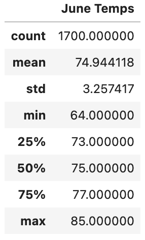
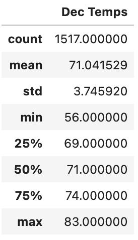
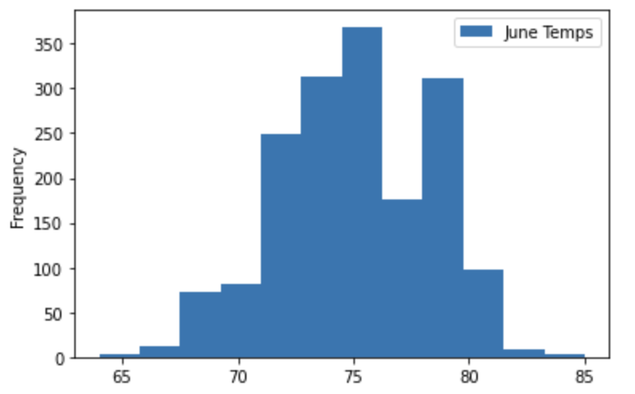
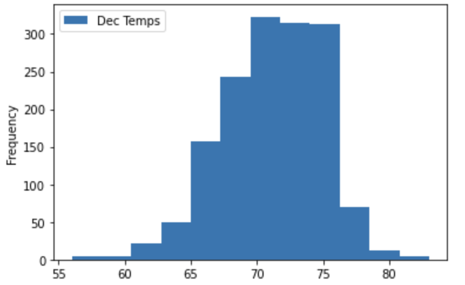
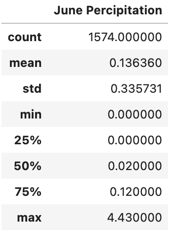
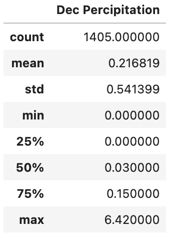

# Purpose fo the project
In order to determine if the surf and ice cream shop is sustainable year-round, W. Avy would like to know the temperture for the month June and December in Oahu.

# Results

- The month of June has average temperture of 74.9°F; High temperture of 85°F; Low temperture of 64°F.

- The month of December has average temperture of 71°F; High temperture of 83°F; Low temperture of 56°F.

- The average temperture between the two months are pretty close, while the month December has bigger range of temperture, we can see from the image that it mostly falls into the range of mid 60s to mid 70s. The month June has mostly above 70s. 

# Summary
The average temperture for the month June and December falls within the low to mid 70s, which is great temperture range for the surf and ice cream shop, with the high temperture in the mid 80s shows that the business can be sustainable year-round.

On top of the temperture, the percipitation for both months are low (as shown below) which is perfect for outdoor activities! From the weather data we gather for the month of June and December, we can see that not just the summer will be great for water activities, but also in the winter! In conclusion, the weather condition in Oahu will be great for a surf and ice cream shop!

